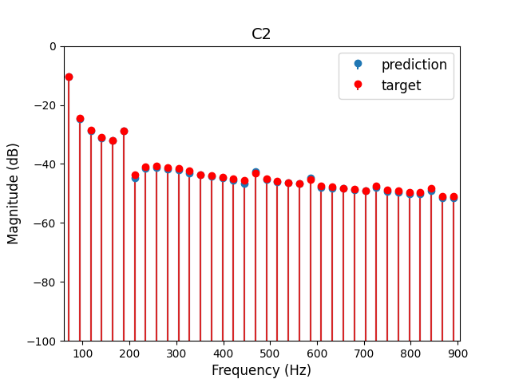
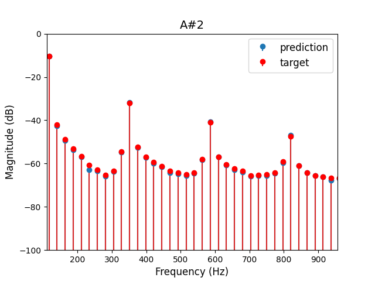
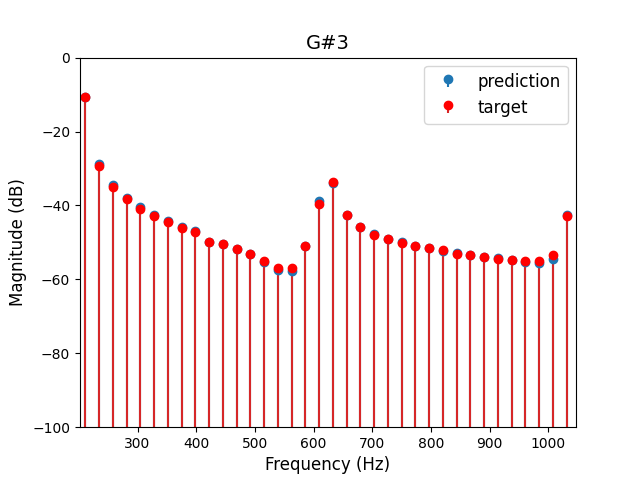
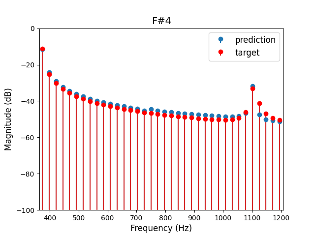
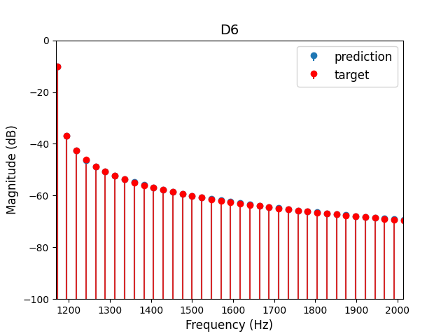

# TOWARDS NEURAL EMULATION OF VOLTAGE-CONTROLLED OSCILLATOR

This code repository is for the article _Towards Neural Emulation of Voltage-Controlled Oscillator_, on review.

This repository contains all the necessary utilities to use our architectures. Find the code located inside the "./Code" folder, and the weights of pre-trained models inside the "./Weights" folder

Visit our [companion page with audio examples](https://riccardovib.github.io/NeuralOSC_pages/))

### Contents

1. [Datasets](#datasets)
2. [How to Train and Run Inference](#how-to-train-and-run-inference)
3. [VST Download](#vst-download)

<br/>

# Datasets

Datsets are available [here](https://zenodo.org/records/15196138)

Our architectures were evaluated on three analog waveshape: 
- Triangle 
- Square
- Sawtooth


# How To Train and Run Inference 

This code relies on tensorflow.
First, install Python dependencies:
```
cd ./code
pip install -r requirements.txt
```

To train models, use the starter.py script.
Ensure you have loaded the dataset into the chosen datasets folder

Available options: 
* --model_save_dir - Folder directory in which to store the trained models [str] (default ="./models")
* --data_dir - Folder directory in which the datasets are stored [str] (default="./datasets")
* --datasets - The names of the datasets to use. [ [str] ] (default=[" "] )
* --epochs - Number of training epochs. [int] (default=60)
* --model - The name of the model to train ('TCN', 'RNN', 'GRU', 'LSTM') [str] (default=" ")
* --batch_size - The size of each batch [int] (default=512)
* --units = The hidden layer size (amount of units) of the network. [ [int] ] (default=64)
* --input_size - The number of samples to use as input [int] (default=96)
* --model_internal_dim - The number of samples to be output of the compression layer (only apply to RNN, GRU and LSTM model) [int] (default=4)
* --kernel_size - The size of the kernel in the TCN layers (only apply to TCN model) [int] (default=3)
* --learning_rate - the initial learning rate [float] (default=3e-4)
* --only_inference - When True, skips training and runs only inference on the pre-model. When False, runs training and inference on the trained model. [bool] (default=False)
 

Example training case: 
```
cd ./code/

python starter.py --datasets OSCMonoSquare --model LSTM --epochs 500
```

To only run inference on an existing pre-trained model, use the "only_inference". In this case, ensure you have the existing model and dataset (to use for inference) both in their respective directories with corresponding names.

Example inference case:
```
cd ./code/

python starter.py --datasets OSCMonoSquare --model LSTM --only_inference True
```

## Aliasing

The proposed methodology learns the target waveshape and replicates any aliasing present in the recordings. Therefore, the quality of the analog antialiasing filter used during the recording of the analog VCO and the digital antialiasing filter applied during data downsampling significantly affect the model's aliasing performance. 
The following frequency domain plots examples demonstrates that the model reproduces the frequency content of the target recordings without introducing additional aliasing.
The plots refer to triangle waves emulated by the LSTM model.

<div align="left">
 
 
 
</div>

<div align="left">
 


</div>

## Frequency-dependent waveshapes

The follow plots demonstrate how the waveshape of the analog VCO undergoes significant changes at various frequencies and how the model effectively learns these variations. 

<div align="left">
 


</div>

# VST Download

Coming soon...

```


## Bibtex
